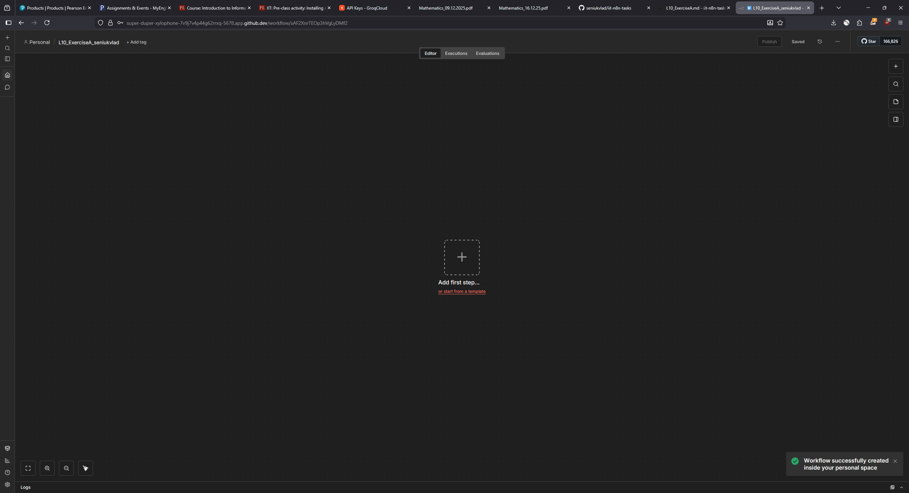
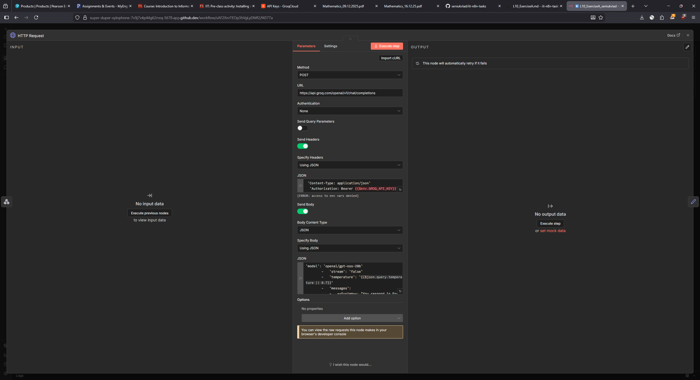
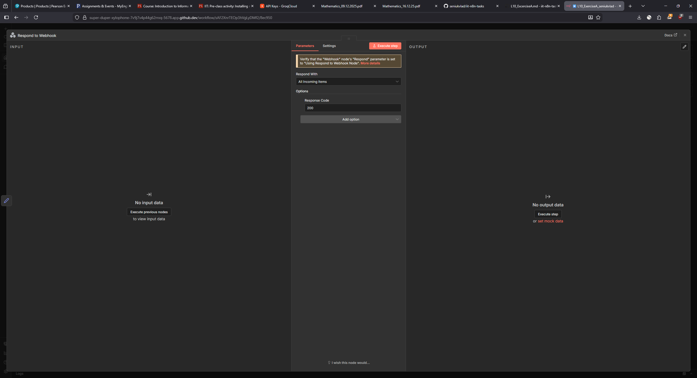
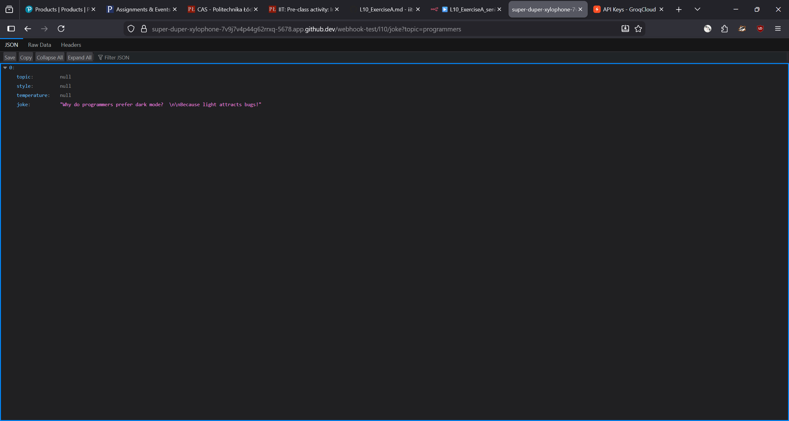

creating empty workflow

the http request node

the respond node

I corrected the HTTP request node so the workfflow to work and pasted API key into the node

The visible result

And example output
[{"topic":null,"style":null,"temperature":null,"joke":"Why do programmers prefer dark mode?  \n\nBecause light attracts bugs!"}]