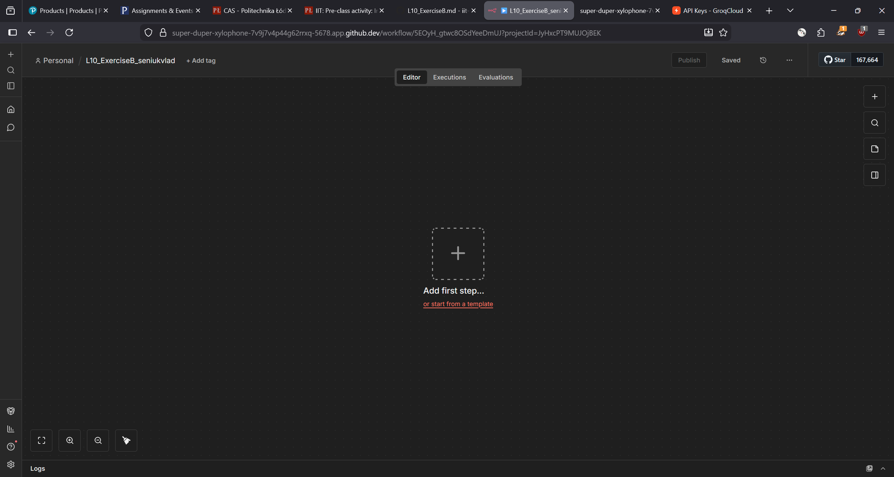
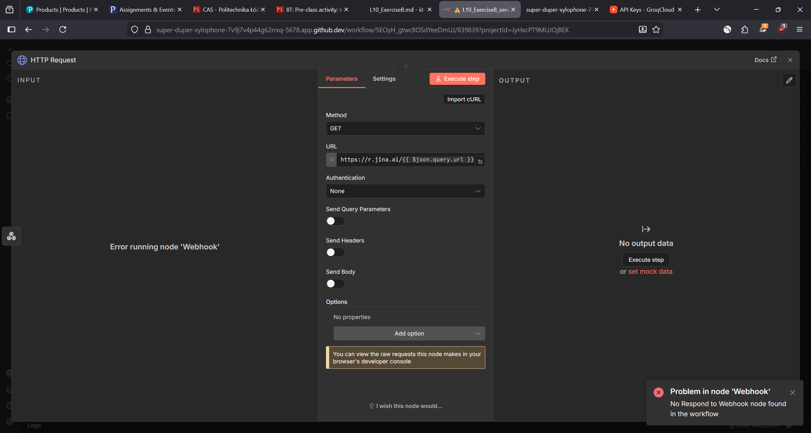
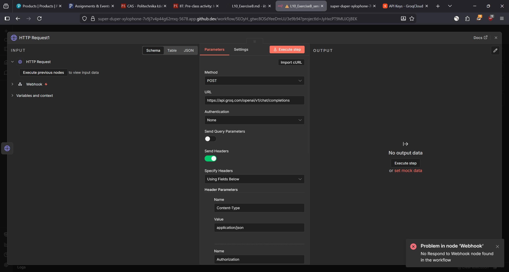
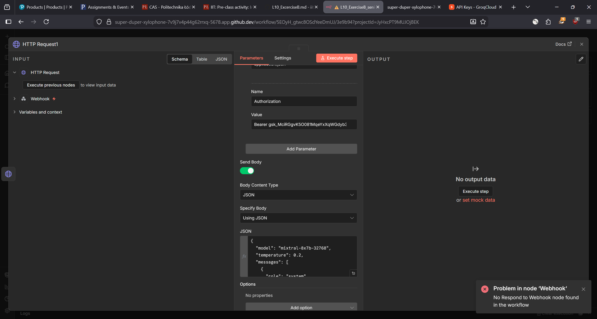
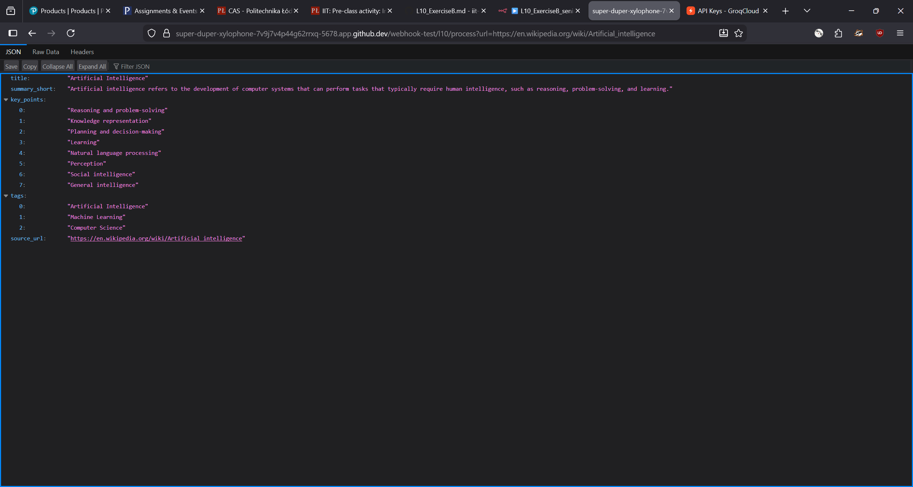

The empty workflow

Jina HTTP Request node

Groq HTTP Request node

The body (Used as JavaScript object to fix some bugs): 
{{
{
  "model": "llama-3.3-70b-versatile",
  "temperature": 0.2,
  "messages": [
    {
      "role": "system",
      "content": "You are a helper that outputs ONLY valid JSON. Follow this schema: { \"title\": \"string\", \"summary_short\": \"string\", \"key_points\": [\"string\"], \"tags\": [\"string\"], \"source_url\": \"string\" }"
    },
    {
      "role": "user",
      "content": "Analyze this text: " + $json.data.substring(0, 10000)
    }
  ]
}
}}

The result of code
