##Excercise A
Creating the empty workflow in n8n

Code node configuration
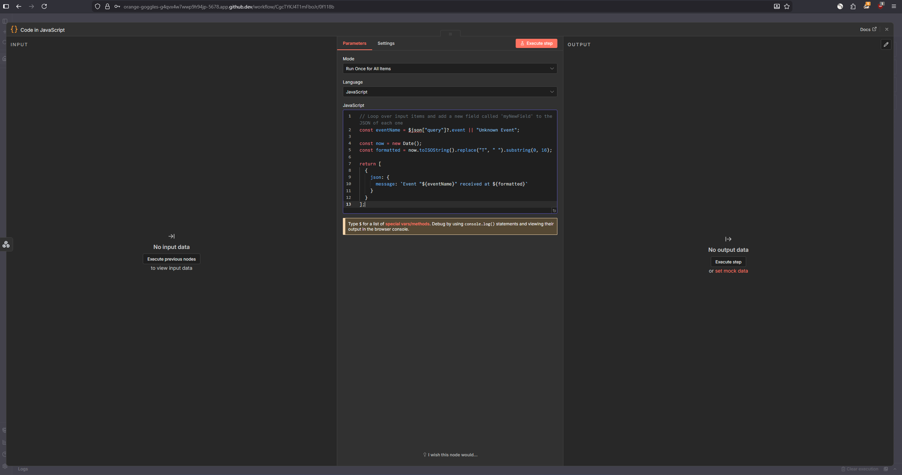

Webhook respond node configuration
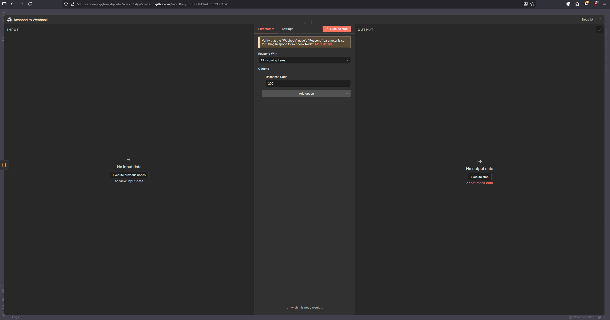

result of execution without parameter
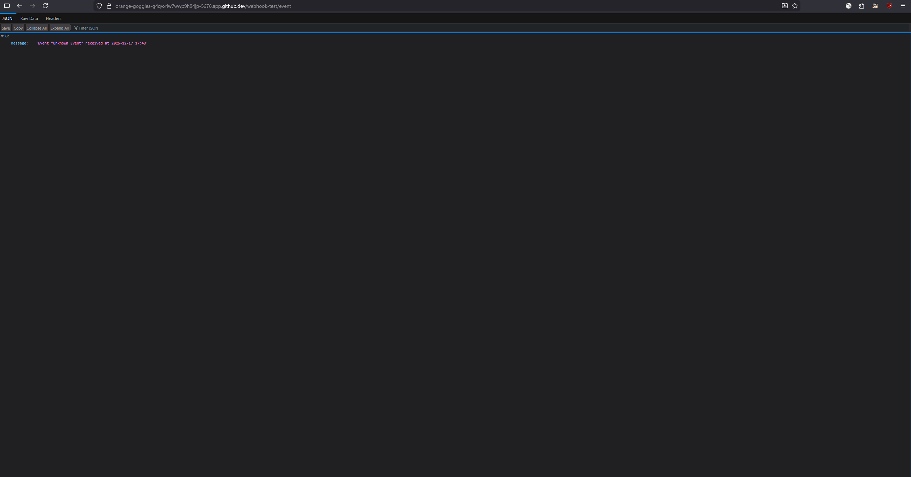

##Exercise B
Creating an  empty workflow
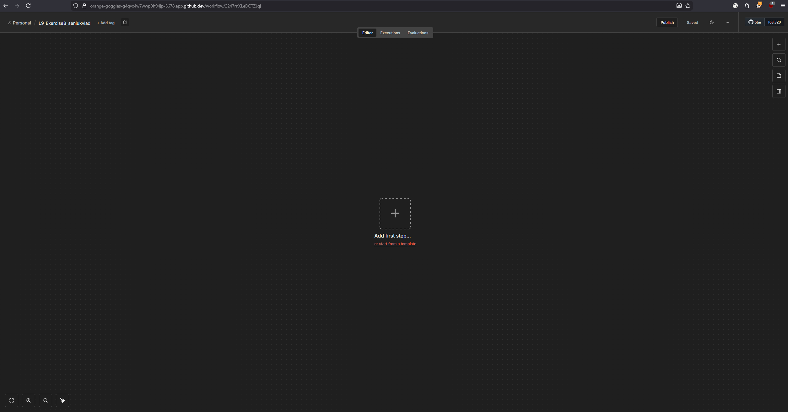

Configuration of HTTP Request node
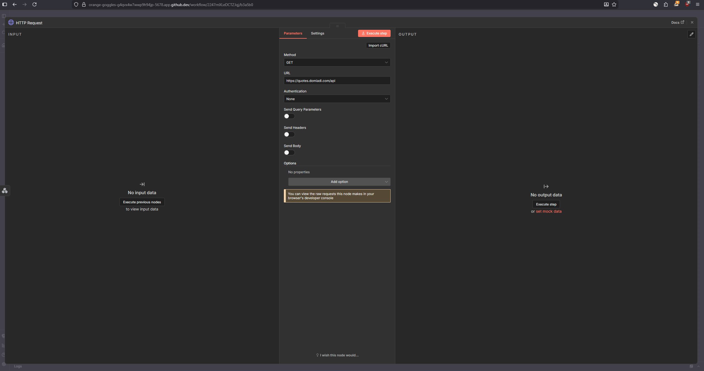

Configuration  of respond webhook
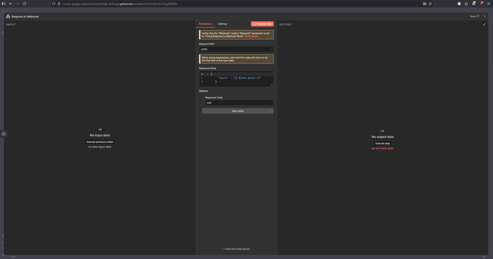

Unfortunately, the domain is wrong, or something in my work went wrong
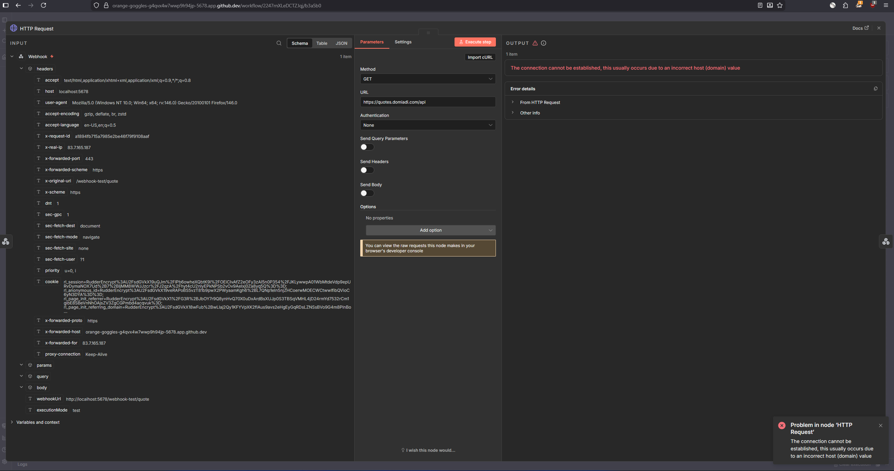
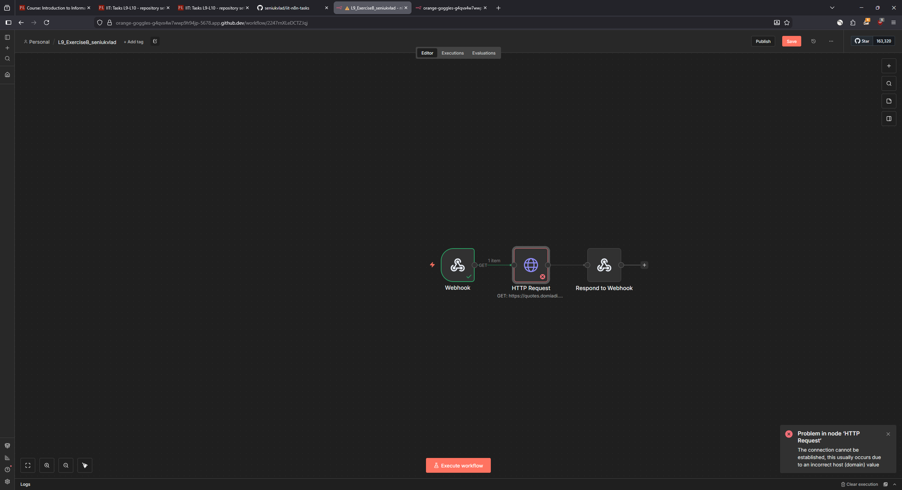

#Exercise C
Creating new  workflow 
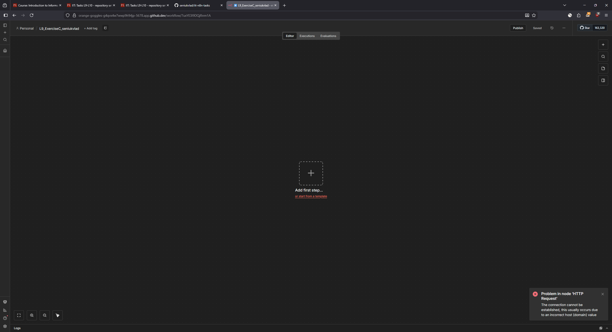

Configuration of respond to webhook 

Unfortunately no succesful output because somehow n8n thinks that file is not writable,
meanwhile the codespace shows that  it is rw for everyone
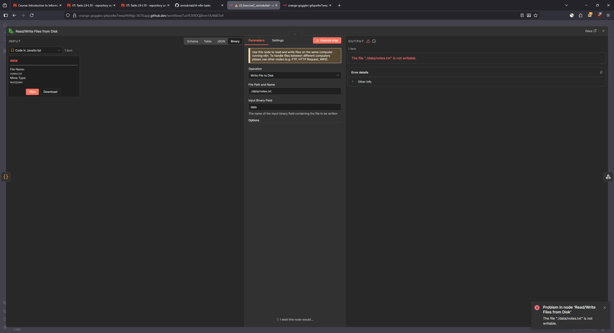
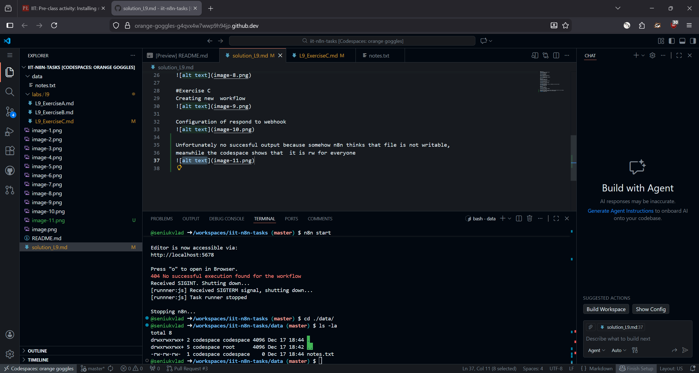

Screenshot of first commit and using of Codespace

